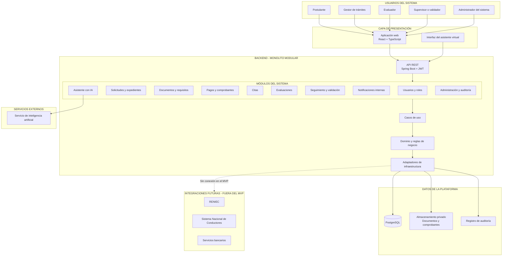

# Arquitectura inicial del sistema

## Estilo arquitectónico

El Sistema de Licencias de Conducir utilizará una **arquitectura monolítica modular**, organizada mediante principios de **Clean Architecture** y **Arquitectura Hexagonal**.

Esta arquitectura permitirá separar la interfaz de usuario, los casos de uso, las reglas de negocio y los servicios de infraestructura. Los módulos formarán parte de una sola aplicación backend, pero mantendrán responsabilidades independientes.

## Diagrama de arquitectura

## Descripción de las capas

### Capa de presentación

Contiene la aplicación web utilizada por los actores. Muestra diferentes paneles y funciones de acuerdo con el rol del usuario.

También incluye la interfaz del asistente virtual, mediante la cual el postulante puede realizar consultas sobre requisitos, pagos, evaluaciones y estado del trámite.

### API REST

Recibe las solicitudes del frontend, verifica la autenticación y dirige cada operación hacia el módulo correspondiente.

La API utilizará JWT y control de acceso basado en roles para impedir que un usuario ejecute funciones que no le corresponden.

### Módulos del sistema

- **Usuarios y roles:** administra cuentas, credenciales, perfiles, roles y permisos.
- **Solicitudes y expedientes:** gestiona las solicitudes y el expediente digital del postulante.
- **Documentos y requisitos:** administra documentos, revisiones y observaciones.
- **Pagos y comprobantes:** registra operaciones y permite la verificación manual de comprobantes.
- **Citas:** administra la programación y reprogramación de atenciones.
- **Evaluaciones:** registra evaluaciones médicas y psicológicas, de conocimientos y de manejo.
- **Seguimiento y validación:** controla los estados del trámite y la aprobación final del expediente.
- **Notificaciones internas:** comunica observaciones, citas, resultados y cambios de estado.
- **Asistente con IA:** brinda orientación mediante contenidos aprobados.
- **Administración y auditoría:** gestiona configuraciones, catálogos, registros y reportes.

### Casos de uso

Coordinan las operaciones del sistema, aplican el flujo correspondiente y controlan la interacción entre los módulos y las reglas de negocio.

### Dominio y reglas de negocio

Contiene las entidades y reglas principales relacionadas con:

- Postulantes.
- Solicitudes.
- Expedientes.
- Documentos.
- Pagos.
- Citas.
- Evaluaciones.
- Resultados.
- Validaciones.
- Licencias.
- Notificaciones.

### Adaptadores de infraestructura

Permiten que el sistema se comunique con la base de datos, el almacenamiento de archivos, la auditoría y el servicio de inteligencia artificial.

También permitirán agregar en el futuro conexiones institucionales sin modificar las reglas principales del sistema.

## Almacenamiento

### PostgreSQL

Almacenará usuarios, roles, solicitudes, estados, citas, evaluaciones, pagos, observaciones y configuraciones.

### Almacenamiento privado

Conservará documentos de identidad, requisitos, certificados y comprobantes. Los archivos solamente podrán ser consultados mediante permisos autorizados.

### Registro de auditoría

Conservará el usuario, la fecha, la operación realizada y los cambios importantes efectuados en el sistema.

## Inteligencia artificial

El asistente virtual se comunicará con un servicio de inteligencia artificial mediante un adaptador controlado.

Antes de realizar una consulta externa, el backend recuperará información aprobada de la base de conocimiento. La IA no podrá modificar expedientes, validar pagos, registrar calificaciones ni autorizar licencias.

## Integraciones futuras

Las conexiones con RENIEC, el Sistema Nacional de Conductores y servicios bancarios estarán fuera del MVP. La arquitectura dejará adaptadores preparados para incorporarlas cuando existan convenios, credenciales y autorizaciones.

Durante el laboratorio estas integraciones serán simuladas.

## Tecnologías propuestas

| Componente | Tecnología |
|---|---|
| Frontend | React, TypeScript y Tailwind CSS |
| Backend | Java 21 y Spring Boot |
| Seguridad | Spring Security y JWT |
| API | REST y OpenAPI |
| Base de datos | PostgreSQL |
| Persistencia | Spring Data JPA |
| Almacenamiento | MinIO o almacenamiento compatible con S3 |
| Inteligencia artificial | API de un modelo de lenguaje mediante un adaptador |
| Contenedores | Docker y Docker Compose |
| Control de versiones | Git y GitHub |
| Integración continua | GitHub Actions |