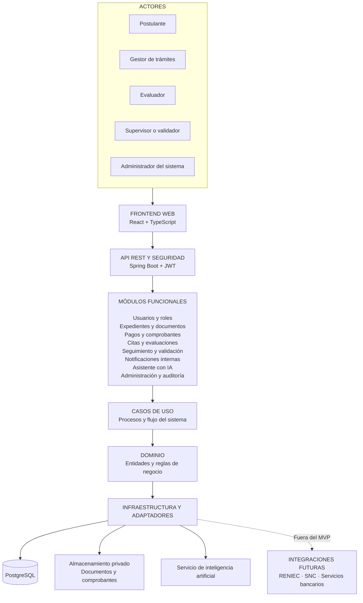

# Arquitectura inicial del sistema

El sistema utilizará una **arquitectura monolítica modular** basada en principios de Clean Architecture. Esta estructura permitirá separar la interfaz, los módulos funcionales, las reglas de negocio y la infraestructura.

## Diagrama de arquitectura

## Componentes principales

- **Frontend:** presenta los paneles según el rol del usuario.
- **API REST:** recibe solicitudes y controla la autenticación y los permisos.
- **Módulos funcionales:** gestionan expedientes, pagos, citas, evaluaciones, seguimiento e inteligencia artificial.
- **Dominio:** contiene las reglas principales del trámite.
- **Infraestructura:** administra la base de datos, archivos y servicios externos.
- **Asistente con IA:** brinda orientación, pero no aprueba trámites ni modifica resultados.

## Tecnologías propuestas

| Componente | Tecnología |
|---|---|
| Frontend | React y TypeScript |
| Backend | Java y Spring Boot |
| Seguridad | Spring Security y JWT |
| Base de datos | PostgreSQL |
| Inteligencia artificial | API de un modelo de lenguaje |
| Despliegue | Docker y Docker Compose |