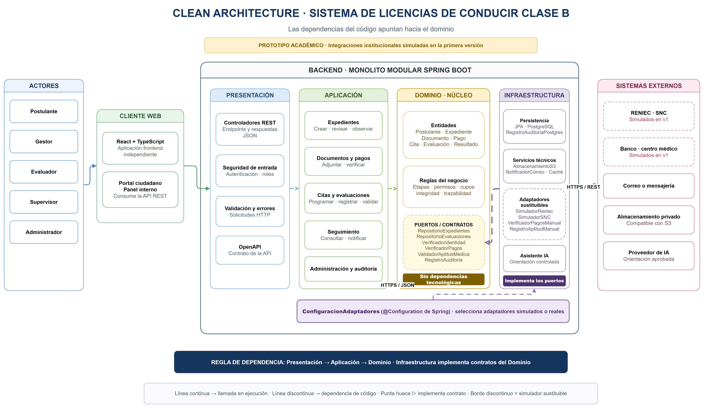

# Enfoque arquitectónico

## Enfoque seleccionado

El Sistema de Licencias de Conducir Clase B utilizará **Clean Architecture con puertos y adaptadores**. Este enfoque separa las reglas del negocio de la interfaz web, la base de datos y los servicios externos.

Esta decisión responde a **DA05 (mantenibilidad y evolución modular)** y **DA08 (integraciones institucionales desacopladas)**, y se encuentra registrada en **ADR-002**.

| Elemento | Aplicación en el sistema |
|---|---|
| **Enfoque** | Clean Architecture con puertos y adaptadores. |
| **Objetivo** | Separar responsabilidades y dirigir las dependencias hacia el dominio. |
| **Problema que resuelve** | Evita el acoplamiento entre Spring Boot, PostgreSQL, el cliente React y los servicios externos. |
| **Capas del backend** | Presentación, Aplicación, Dominio e Infraestructura. |
| **Beneficio principal** | Permite sustituir tecnologías e integraciones sin modificar las reglas principales. |

## Capas

Las capas se presentan desde el núcleo hacia los detalles externos.

### Dominio

Contiene las entidades, reglas del negocio y puertos del sistema:

- Postulante, expediente, requisito y documento.
- Pago, cita, evaluación y resultado.
- Estados del trámite y eventos de auditoría.
- Reglas de etapas, permisos, cupos e integridad de resultados.

El dominio no depende de Spring Boot, PostgreSQL, React ni proveedores externos.

### Aplicación

Contiene los casos de uso que coordinan el dominio:

- Crear y revisar expedientes.
- Verificar documentos y pagos.
- Programar citas.
- Registrar y validar resultados.
- Consultar el seguimiento y enviar notificaciones.

### Presentación

El portal React es un cliente externo que consume la API. La capa de Presentación del backend contiene:

- Controladores REST.
- Autenticación y autorización por roles.
- Validación de solicitudes.
- Respuestas JSON y documentación OpenAPI.

### Infraestructura

Implementa los puertos definidos en el dominio mediante:

- Spring Data JPA y PostgreSQL.
- Almacenamiento privado de documentos.
- Correo, mensajería y caché de información pública.
- Adaptadores para RENIEC, SNC, banco, centro médico e inteligencia artificial.

Las integraciones institucionales restringidas serán simuladas durante la primera versión académica.

## Puertos y adaptadores

Los puertos son interfaces definidas en el dominio; la infraestructura las implementa.

| Puerto del dominio | Adaptador de infraestructura |
|---|---|
| `RepositorioExpedientes` | Spring Data JPA y PostgreSQL |
| `RepositorioEvaluaciones` | Spring Data JPA y PostgreSQL |
| `RepositorioDocumentos` | Almacenamiento privado compatible con S3 |
| `VerificadorIdentidad` | `SimuladorReniec` en la primera versión |
| `ConsultaSNC` | `SimuladorSNC` en la primera versión |
| `VerificadorPagos` | `VerificadorPagosManual` |
| `ValidadorAptitudMedica` | `RegistroAptitudManual` |
| `ServicioNotificaciones` | Notificaciones internas en la primera versión; correo opcional |
| `RegistroAuditoria` | PostgreSQL |
| `ServicioAsistenteVirtual` | Proveedor de IA controlado |

La clase de configuración de Spring actúa como raíz de composición y selecciona qué adaptador implementará cada puerto. Así, un simulador podrá sustituirse por una integración autorizada sin cambiar el dominio.

## Regla de dependencia

Las dependencias del código apuntan hacia el dominio:

```text
Cliente React ──HTTPS/JSON──► Presentación
Presentación ───────────────► Aplicación ───────────────► Dominio
Infraestructura ────────────► Puertos definidos en el Dominio
```

## Ejemplo: validar un resultado

1. El supervisor solicita la validación desde el cliente web.
2. El controlador ejecuta el caso de uso `ValidarResultado`.
3. El dominio verifica las reglas y bloquea el resultado validado.
4. `RepositorioEvaluaciones` guarda el cambio mediante PostgreSQL.
5. `RegistroAuditoria` registra la operación.
6. `ServicioNotificaciones` informa al postulante.

## Diagrama del enfoque arquitectónico

