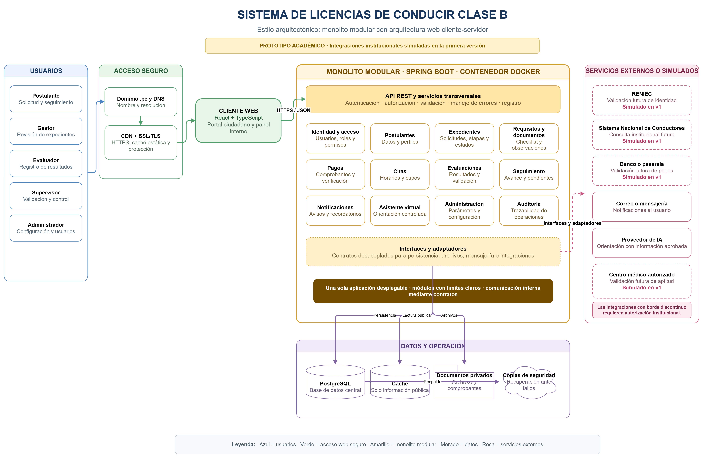

# Estilo arquitectónico del sistema

## Estilo seleccionado

El Sistema de Licencias de Conducir Clase B utilizará un **monolito modular con arquitectura web cliente-servidor**.

El sistema se ejecutará inicialmente como una sola aplicación backend desplegable, pero sus funcionalidades estarán organizadas en módulos con responsabilidades claramente definidas. Esta organización permitirá mantener una implementación accesible para el equipo y facilitará la modificación o evolución de cada módulo.

## Justificación

Se seleccionó un monolito modular porque el proyecto será desarrollado por un equipo pequeño y no requiere inicialmente la complejidad operativa de una arquitectura de microservicios.

Este estilo permite:

- Mantener una sola aplicación backend desplegable.
- Separar las funcionalidades mediante módulos.
- Compartir una base de datos central de forma controlada.
- Simplificar el desarrollo, las pruebas y el despliegue.
- Reducir los costos de infraestructura.
- Aplicar seguridad y auditoría de manera centralizada.
- Preparar los módulos para una posible separación futura.

## Componentes principales

| Componente | Responsabilidad |
|---|---|
| **Portal web** | Proporcionar las interfaces para postulantes, gestores, evaluadores, supervisores y administradores. |
| **API REST** | Recibir las solicitudes del portal web y exponer las operaciones autorizadas del sistema. |
| **Monolito modular** | Ejecutar los casos de uso, reglas del negocio, validaciones y coordinación de los módulos. |
| **PostgreSQL** | Almacenar usuarios, expedientes, documentos, pagos, citas, evaluaciones, resultados, estados y auditoría. |
| **Almacenamiento privado** | Conservar documentos personales, comprobantes y archivos adjuntos con acceso restringido. |
| **Servicio de notificaciones** | Enviar avisos sobre observaciones, citas, resultados, cambios de estado y acciones pendientes. |
| **Caché** | Almacenar temporalmente categorías, requisitos y otra información pública de consulta frecuente. |
| **CDN** | Distribuir archivos estáticos públicos del portal para mejorar los tiempos de carga. |

## Tecnologías

| Componente | Tecnología |
|---|---|
| Cliente web | React y TypeScript |
| Backend | Java y Spring Boot (una sola aplicación) |
| Seguridad | Spring Security y JWT |
| Base de datos | PostgreSQL |
| Despliegue | Contenedor Docker |

## Módulos del monolito

El backend estará dividido en los siguientes módulos:

- **Identidad y acceso:** autenticación, usuarios, roles y permisos.
- **Postulantes:** información personal y perfil del ciudadano.
- **Expedientes:** solicitudes, categorías, etapas, estados, validación del expediente y emisión simulada.
- **Requisitos y documentos:** checklist, documentos adjuntos y observaciones.
- **Pagos:** registro de comprobantes y verificación manual.
- **Citas:** fechas, horarios, cupos y programación.
- **Evaluaciones:** aptitud médica, exámenes de conocimientos y habilidades de conducción.
- **Seguimiento:** avance del expediente y acciones pendientes.
- **Notificaciones:** avisos y recordatorios internos de la plataforma.
- **Asistente virtual:** orientación basada en información previamente aprobada.
- **Administración:** configuración de categorías, requisitos, etapas y usuarios, y reportes.
- **Auditoría:** registro de operaciones y modificaciones importantes.

## Usuarios del sistema

Los actores accederán al mismo sistema mediante interfaces y permisos diferentes:

- Postulante.
- Gestor.
- Evaluador.
- Supervisor.
- Administrador.

El control de acceso impedirá que un usuario consulte o modifique información que no corresponda a sus funciones.

## Servicios externos

Las integraciones futuras se conectarán mediante interfaces y adaptadores:

| Servicio | Uso | Primera versión |
|---|---|---|
| RENIEC | Validación de identidad | Simulado; verificación manual del gestor |
| Sistema Nacional de Conductores | Consultas y registros institucionales | Simulado |
| Banco o pasarela de pagos | Validación de pagos | Simulado; verificación manual del comprobante |
| Centro médico autorizado | Aptitud médica | Simulado; registro manual del certificado |
| Correo o mensajería | Notificaciones externas | Opcional; el MVP usa notificaciones internas (RC07) |
| Proveedor de inteligencia artificial | Orientación controlada | Limitado a contenido aprobado |
| Almacenamiento compatible con S3 | Documentos privados | Almacenamiento privado con acceso restringido |

Las integraciones institucionales requieren autorización, por lo que en la primera versión académica se implementan mediante adaptadores simulados.

## Despliegue y seguridad

La solución considerará:

- Dominio propio, incluyendo la posibilidad de utilizar un dominio `.pe`.
- Configuración de DNS.
- Certificado SSL/TLS y uso obligatorio de HTTPS.
- Frontend desplegado en una plataforma con CDN y HTTPS automático.
- Backend desplegado como un contenedor.
- Base de datos PostgreSQL administrada.
- Almacenamiento privado para documentos.
- Copias de seguridad periódicas.
- Variables de entorno para proteger credenciales.
- Contraseñas almacenadas mediante algoritmos de hash seguros.
- Caché limitada a información pública.
- Registro de operaciones mediante una bitácora de auditoría.

El uso de servicios independientes de base de datos, almacenamiento, correo, caché o CDN no convierte la aplicación en microservicios. El backend continuará siendo un monolito modular porque sus módulos se ejecutarán y desplegarán como una sola aplicación.

## Diagrama del estilo arquitectónico

## Relación con los drivers

El estilo seleccionado responde principalmente a los siguientes drivers:

- **DA01:** control de acceso según roles.
- **DA02:** protección de datos personales y médicos.
- **DA03:** trazabilidad de las operaciones.
- **DA05:** mantenibilidad y evolución modular.
- **DA08:** integraciones institucionales desacopladas.
- **DA09:** rendimiento y disponibilidad.
- **DA10:** facilidad de uso y accesibilidad.